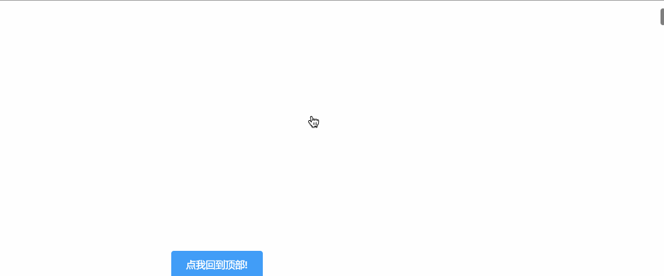

# easy-go-top | 简单 & 强大的 vue 回到顶部组件

[](https://opensource.org/licenses/mit-license.php)
[](https://www.npmjs.com/package/easy-go-top)
[](https://www.npmjs.com/package/easy-go-top)
[](https://npmcharts.com/compare/easy-go-top?minimal=true)

## 介绍

目前 GitHub 上已有不少回到顶部的组件, 但是要不然是可定制化不够, 要不然就是不够简单, 所以就像写一个即能很简单, 但同时很强大的回到顶部的 vue 组件, 根据场景不同, easy-go-top 组件用于以下特性:

- 支持全局引入, 并设置全局参数, 使用时无需重复传参
- 支持 js 回到顶部(用于加载数据后, 回到顶部等场景)
- 支持 css 和 js 两种样式覆盖形式, 定制化更容易

## 效果图



## 文档和示例

[https://dream2023.github.io/easy-go-top/](https://dream2023.github.io/easy-go-top/)

## 安装

```bash
npm install easy-go-top --save
```

## 使用

```js
// 全局引入(推荐)
import EasyGoTop from 'easy-go-top'
Vue.use(EasyGoTop)
```

```js
// 全局引入定制化
Vue.use(EasyGoTop, {
  size: 52,
  color: '#9aaabf',
  backgroundColor: 'rgb(231, 234, 241)',
  innerHTML: '<svg viewBox="0 0 17 17"><g><path d="M12.036 15.59c0 .55-.453.995-.997.995H5.032c-.55 0-.997-.445-.997-.996V8.584H1.03c-1.1 0-1.36-.633-.578-1.416L7.33.29c.39-.39 1.026-.385 1.412 0l6.878 6.88c.782.78.523 1.415-.58 1.415h-3.004v7.004z" fill-rule="evenodd"></path></g></svg>'
  ... // 全部参数参考props参数
})
```

```js
// 局部引入
import { EasyGoTop, easyGoTopMixin } from 'easy-go-top/src/index'
export default {
  components: {
    EasyGoTop
  },
  // 如果需要使用js触发回到顶部, 则需要引入mixin, 否则不需要
  minxins: [easyGoTopMixin]
}
```

## 示例

### 最简单的使用

```html
<!-- 最简单的使用: 如果想要使用默认参数 或者 全局设置了参数, 使用组件即可 -->
<easy-go-top />
```

### 定制化

```html
<!-- 定制化: 局部引入, 或者全局引入后未设置参数, 想要定制化, 则需要指定参数 -->
<easy-go-top :size="52" color="#9aaabf" backgroundColor="rgb(231, 234, 241)" />
```

### js 调用

```js
// 全局引入, 直接调用, 局部引入时, 记得要手动注册mixin
this.$goTop()
```

### 支持插槽

```html
<easy-go-top><i class="iconfont icon-rocket"></i></easy-go-top>
```

### 样式覆盖

#### js 进行样式覆盖

```js
// 全局引入时
Vue.use(EasyGoTop, {
  customStyle: {
    boxShadow: 'none'
  }
})
```

```html
<!-- 或使用时 -->
<easy-go-top :customStyle="{ boxShadow: 'none' }" />
```

#### css 样式覆盖

```css
#easy-go-top {
  box-shadow: none;
  /* 如果不行, 则试试, box-shadow: none !important */
}
```

## Props 参数

> 特别说明, innerHTML 参数, 不仅可以传递文本等, 还可以传递例如 svg 或者 iconfont 的 i 标签等 HTML

```js
props: {
  // 大小: 如果未赋值 width 和 height, 则 width = size, height = size,
  // 如果赋值了 width 或 height, 会覆盖 size 的 值
  size: {
    type: Number,
    default: 50
  },
  // 宽度: 当定义 width 时, 会覆盖 size 值
  width: {
    type: Number
  },
  // 高度: 当定义 height 时, 会覆盖 size 值
  height: {
    type: Number
  },
  // 字体颜色
  color: {
    type: String,
    default: '#fff'
  },
  // 圆角
  radius: {
    type: Number,
    default: 50
  },
  // z-index值
  zIndex: {
    type: Number,
    default: 10
  },
  // 绝对定位: 距离右侧距离
  right: {
    type: Number,
    default: 20
  },
  // 绝对定位: 距离底部距离
  bottom: {
    type: Number,
    default: 40
  },
  // 内容: 可以传递svg 和 iconfont等
  innerHTML: {
    type: String,
    default: '<svg viewBox="0 0 24 24"><path d="M7.41 15.41L12 10.83l4.59 4.58L18 14l-6-6-6 6z"></path></svg>'
  },
  // 背景色
  backgroundColor: {
    type: String,
    default: '#000'
  },
  // 可见高度: 即滚动距离顶部多高时显示组件
  visibilityHeight: {
    type: Number,
    default: 400
  },
  // 自定义样式
  customStyle: {
    type: Object
  }
}
```

## 参考链接

- [vue-element-admin 全局组件 back-to-top](https://github.com/PanJiaChen/vue-element-admin/tree/master/src/components/BackToTop)
- [Vanilla Back To Top](https://github.com/vfeskov/vanilla-back-to-top)
- [bga-back-top-vue](https://github.com/bingoogolapple/bga-back-top-vue)
